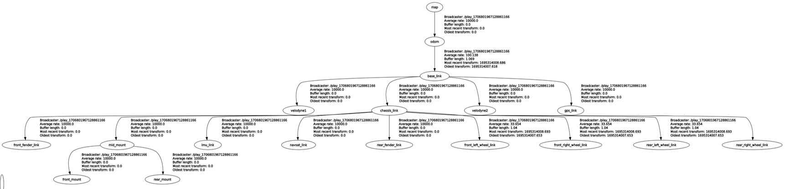

# Purdue ACRE Cornfield Dataset

This dataset, collected with Purdue-AgBot (P-AgBot) at the [Agronomy Center for Research and Education (ACRE)](https://ag.purdue.edu/department/agry/acre/index.html) during Summer 2023, supports research in autonomous navigation and crop monitoring in cornfields.

    

    <video src="ACRE_video.mp4" autoplay loop muted>
    Your browser does not support the video tag.
    </video>

## Overview

- **Sensor Data**: Includes 3D LiDAR, IMU, wheel encoders, and RTK GPS.
- **Environments**: ACRE cornfields under various weather conditions and growth stages. P-AgBot drove under the canopies in the cornfields.
- **Challenges**: Collected data in environments which contain hanging leaves and rough terrain.

## Robot Platform and Sensors

- **Unmanned Ground Vehicle (UGV)**: [Clearpath Jackal](https://clearpathrobotics.com/jackal-small-unmanned-ground-vehicle/) (`base_link`)
- **3D LiDAR**: Two [Velodyne VLP-16](https://velodynelidar.com/products/puck/) units mounted for horizontal (`velodyne1`) and vertical (`velodyne2`) scanning.
- **IMU**: [Internal IMU](https://www.clearpathrobotics.com/assets/guides/kinetic/jackal/calibration.html) in UGV (`imu_link`)
- **Wheel Encoder**: Internal wheel encoder in UGV
- **RTK GPS**: [Emlid M2](https://emlid.com/reach/) (`gps_link`)

## Accessing the Dataset

- **Download the dataset [here](https://purdue0-my.sharepoint.com/:f:/g/personal/kim3686_purdue_edu/Epm1jo1fP0NDjPju2Hosr5IB2RTKf_Hui_8v6oN-yAAyRg?e=obvB6V).**

## Data Description

Data is sorted by collection date and GPS availability, containing Rosbag (*.bag) files. Each file includes a comprehensive set of sensor measurements.

### Figures 

* **Coordinate Frames of P-AgBot**

    

* **TF Tree Visualization**

    

*For details on sensor transformations, see [static_transform.txt](static_transform.txt)*

### Data Folders

| Folder      | Number of Files | Size (GB)        |
|-------------|-----------------|------------------|
| with_GPS    | 18              | 86.3             |
| without_GPS | 14              | 51.9             |

### ROS Topics

| Topic                  | Description                                          | ROS Message Type            |
|------------------------|------------------------------------------------------|-----------------------------|
| `/cmd_vel`             | Robot linear/angular velocity                        | `geometry_msgs/Twist`       |
| `/gps/fix`             | RTK GPS measurements                                 | `sensor_msgs/NavSatFix`     |
| `/imu/data`            | Robot IMU data                                       | `sensor_msgs/Imu`           |
| `/ns1/velodyne_points` | Point cloud from horizontal LiDAR `velodyne1`        | `sensor_msgs/PointCloud2`   |
| `/ns2/velodyne_points` | Point cloud from vertical LiDAR `velodyne2`          | `sensor_msgs/PointCloud2`   |
| `/odometry/filtered`   | Filtered odometry from wheel encoders and IMU fusion | `nav_msgs/Odometry`         |
| `/tf`                  | Sensor coordinate frames relationship                | `tf2_msgs/TFMessage`        |

<!-- | ROS Topic   | Description     | ROS message type |
|-------------|-----------------|------------------|
| /cmd_vel    | Robot linear/angular velocity              | geometry_msgs/Twist              |
| /gps/fix | RTK GPS measurements               | sensor_msgs/NavSatFix               |
| /imu/data | Robot IMU               | sensor_msgs/Imu               |
| /ns1/velodyne_points | Point cloud from a horizontal LiDAR               | sensor_msgs/PointCloud2               |
| /ns2/velodyne_points | Point cloud from a vertical LiDAR               | sensor_msgs/PointCloud2 |
| /odometry/filtered | Filtered odometry from the fusion of wheel encoders and IMU | nav_msgs/Odometry |
| /odometry/filtered | Filtered odometry from the fusion of wheel encoders and IMU | nav_msgs/Odometry |
| /tf | Relationship between sensor coordinate frames | tf2_msgs/TFMessage | -->

<!-- ### Playing SVO Files (Optional)

For higher resolution images and depth quality:
1. Install the [ZED SDK](https://www.stereolabs.com/developers/release/) (requires CUDA).
2. Install the [ZED ROS Wrapper](https://www.stereolabs.com/docs/ros/).
3. Play SVO files using the ZED ROS Wrapper (instructions in the supplementary material). -->

<!-- ## Using the Dataset

### Overview

- **Contents**: 3D LiDAR, IMU, RTK GPS, wheel encoder measurements.
- **Environments**: Cornfields with varying weather conditions and growth stages.
- **Challenges**: Includes arbitrary occlusions from hanging leaves, and rough terrain.

### Building Custom ROS Messages

To read custom GPS and motor messages:
1. Download and build the [fpn_msgs](https://uofi.box.com/shared/static/sxfuvw9njpm2e2mbcfncirdxx70kn165.zip) package in your ROS workspace.
2. Build the package with `catkin_make fpn_msgs` and source your workspace.

### Extracting Data from Rosbag Files

Follow the instructions in the supplementary material to extract specific data using the provided Python script.

### Sensor Calibration

Download the [sensor_parameters.txt](sensor_parameters.txt) file for calibration information and robot coordinate frames details. -->
