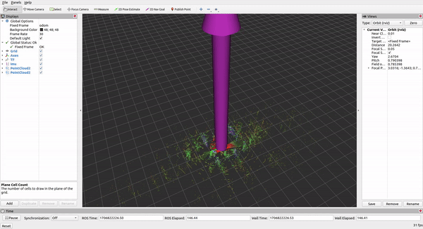
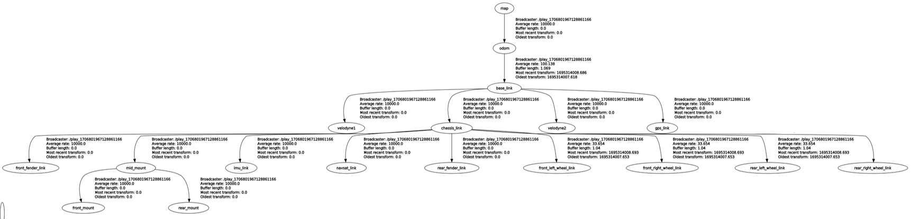

# Purdue ACRE Cornfield Dataset

This dataset, collected with Purdue-AgBot (P-AgBot) at the [Agronomy Center for Research and Education (ACRE)](https://ag.purdue.edu/department/agry/acre/index.html) during Summer 2023, supports research in autonomous navigation and crop monitoring in cornfields.

<p align="center">
    <a href="./images/ACRE_image.png" target="_blank">
        
    </a>
</p>

<p align="center">
  
</p>

## Overview

- **Sensor Data**: Includes 3D LiDAR, IMU, wheel encoders, and RTK GPS.
- **Environments**: ACRE cornfields under various weather conditions and growth stages. P-AgBot drove under the canopies in the cornfields.
- **Challenges**: Collected data in environments which contain hanging leaves and rough terrain.

## Robot Platform and Sensors

- **Unmanned Ground Vehicle (UGV)**: [Clearpath Jackal](https://clearpathrobotics.com/jackal-small-unmanned-ground-vehicle/) (`base_link`)
- **3D LiDAR**: Two [Velodyne VLP-16](https://velodynelidar.com/products/puck/) units mounted for horizontal (`velodyne1`) and vertical (`velodyne2`) scanning.
- **IMU**: [Internal IMU](https://www.clearpathrobotics.com/assets/guides/kinetic/jackal/calibration.html) in UGV (`imu_link`)
- **Wheel Encoder**: Internal wheel encoder in UGV
- **RTK GPS**: [Emlid M2](https://emlid.com/reach/) (`gps_link`)


## Accessing the Dataset

- **Download the dataset [here](https://purdue0-my.sharepoint.com/:f:/g/personal/kim3686_purdue_edu/Epm1jo1fP0NDjPju2Hosr5IB2RTKf_Hui_8v6oN-yAAyRg?e=obvB6V).**

## Data Description

Data is sorted by collection date and GPS availability, containing Rosbag (*.bag) files. Each file includes a comprehensive set of sensor measurements.

### Figures 

* **Coordinate Frames of P-AgBot**

<p align="center">
    <a href="./images/tf_image.png" target="_blank">
        
    </a>
</p>

* **TF Tree Visualization**

<p align="center">
    <a href="./images/tf_tree.png" target="_blank">
        
    </a>
</p>

*For details on sensor transformations, see [static_transform.txt](static_transform.txt)*


### Data Folders

| Folder      | Number of Files | Size (GB)        |
|-------------|-----------------|------------------|
| with_GPS    | 18              | 86.3             |
| without_GPS | 14              | 51.9             |


### ROS Topics

| Topic                  | Description                                          | ROS Message Type            |
|------------------------|------------------------------------------------------|-----------------------------|
| `/cmd_vel`             | Robot linear/angular velocity                        | `geometry_msgs/Twist`       |
| `/gps/fix`             | RTK GPS measurements                                 | `sensor_msgs/NavSatFix`     |
| `/imu/data`            | Robot IMU data                                       | `sensor_msgs/Imu`           |
| `/ns1/velodyne_points` | Point cloud from horizontal LiDAR `velodyne1`        | `sensor_msgs/PointCloud2`   |
| `/ns2/velodyne_points` | Point cloud from vertical LiDAR `velodyne2`          | `sensor_msgs/PointCloud2`   |
| `/odometry/filtered`   | Filtered odometry from wheel encoders and IMU fusion | `nav_msgs/Odometry`         |
| `/tf`                  | Sensor coordinate frames relationship                | `tf2_msgs/TFMessage`        |


-------------------
## Citations
If you use this dataset for your research, please consider citing our works:

```
@ARTICLE{10494876,
  author={Kim, Kitae and Deb, Aarya and Cappelleri, David J.},
  journal={IEEE Robotics and Automation Letters}, 
  title={P-AgSLAM: In-Row and Under-Canopy SLAM for Agricultural Monitoring in Cornfields}, 
  year={2024},
  volume={9},
  number={6},
  pages={4982-4989},
  keywords={Feature extraction;Laser radar;Robots;Simultaneous localization and mapping;Three-dimensional displays;Point cloud compression;Monitoring;Agricultural automation;robotics and automation in agriculture and forestry;SLAM},
  doi={10.1109/LRA.2024.3386466}}
```
```
@INPROCEEDINGS{10341516,
  author={Deb, Aarya and Kim, Kitae and Cappelleri, David J.},
  booktitle={2023 IEEE/RSJ International Conference on Intelligent Robots and Systems (IROS)}, 
  title={Deep Learning-Based Leaf Detection for Robotic Physical Sampling with P-AgBot}, 
  year={2023},
  volume={},
  number={},
  pages={8291-8297},
  keywords={YOLO;Deep learning;Three-dimensional displays;Robot kinematics;Robot vision systems;Crops;Grasping},
  doi={10.1109/IROS55552.2023.10341516}}
```
```
@ARTICLE{9810180,
  author={Kim, Kitae and Deb, Aarya and Cappelleri, David J.},
  journal={IEEE Robotics and Automation Letters}, 
  title={P-AgBot: In-Row & Under-Canopy Agricultural Robot for Monitoring and Physical Sampling}, 
  year={2022},
  volume={7},
  number={3},
  pages={7942-7949},
  keywords={Crops;Robots;Laser radar;Navigation;Monitoring;Three-dimensional displays;Autonomous robots;Field robots;agricultural automation},
  doi={10.1109/LRA.2022.3187275}}
```
